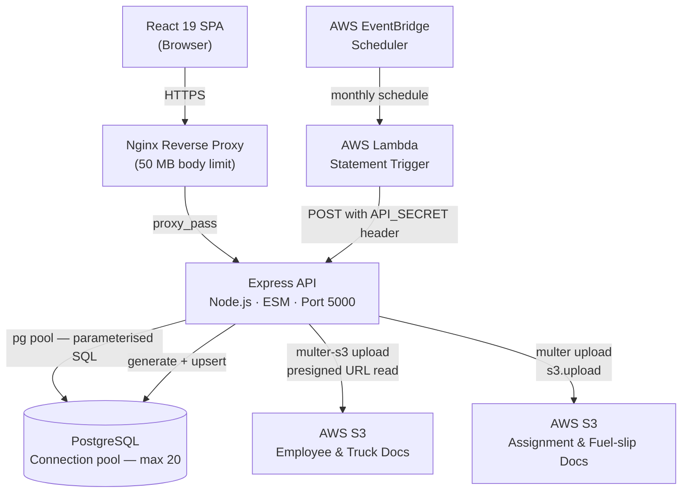

# Trucking Logistics Management Platform

## 1. System Overview

A full-stack operations and financial management platform built for a logistics client, covering the complete job lifecycle from instruction creation through invoicing, payment allocation, and monthly financial reporting. The system manages multiple actor roles (controllers, finance clerks, directors, subcontractors) across a shared PostgreSQL database, with document storage in S3 and automated monthly statement generation driven by AWS EventBridge.

---

## 2. Architecture Diagram



**Request lifecycle (authenticated API call):**
1. Browser sends `Authorization: Bearer <jwt>` with every request after login.
2. Nginx forwards to Express on port 5000.
3. `verifyToken` middleware validates the JWT against the process-lifetime secret.
4. Controller calls the model layer, which executes a parameterised `pg` query.
5. Response JSON is returned; for document access, a time-limited S3 presigned URL is generated server-side and returned to the client.

**Scheduled statement generation:**
EventBridge fires a Lambda on the 1st of each month. Lambda calls `POST /api/statements/generate` with an `API_SECRET` bearer token. Express authenticates the token separately from the user JWT path and runs `generateMonthlyStatements()` inside a single PostgreSQL transaction.

---

## 3. Tech Stack

| Layer | Technology | Rationale |
|---|---|---|
| Frontend framework | React 19 | Concurrent rendering features; stable ecosystem for a data-heavy internal tool |
| Routing | React Router v7 | File-based layout with nested routes; matches the role-scoped page hierarchy |
| Styling | Tailwind CSS v4 | Utility-first avoids a growing custom CSS surface; co-located styles reduce context switching |
| Animation | Framer Motion | Declarative transitions for modals and page entries without hand-writing CSS keyframes |
| Charts | Recharts + Chart.js / react-chartjs-2 | Recharts for composable data viz; Chart.js for specific chart types not covered by Recharts |
| PDF generation | jsPDF + jspdf-autotable + html2pdf.js | Client-side PDF rendering for tax invoices and wage slips without a server-side PDF service |
| Excel export | ExcelJS | Structured `.xlsx` export for financial reports |
| HTTP client | Axios | Interceptors used for attaching the JWT header globally |
| Backend framework | Express.js | Minimal, well-understood; appropriate for a structured REST API without GraphQL complexity |
| Authentication | Passport.js (LocalStrategy) + JWT | Passport handles interactive session login; JWT middleware handles stateless API calls from the SPA |
| Password hashing | bcrypt (cost 10) | Industry-standard adaptive hashing; cost factor configurable |
| Database | PostgreSQL | Strong support for JSONB, array types, and window functions required by the analytics queries |
| Database client | node-postgres (`pg`) — raw SQL | Complex CTEs and lateral joins in the analytics layer are easier to write and reason about in raw SQL than in a query builder |
| File storage | AWS S3 (af-south-1) | Durable object storage for compliance documents; presigned URLs keep credentials server-side |
| File upload middleware | multer-s3 / multer | Streams multipart uploads directly to S3 without buffering to disk |
| Scheduled jobs | AWS Lambda + EventBridge Scheduler | Decouples the monthly statement generation schedule from the application process, so a restart or deploy does not cause a missed run |
| Reverse proxy | Nginx (AWS Elastic Beanstalk `.platform`) | Handles TLS termination and the 50 MB body limit needed for document uploads |
| Runtime module system | ESM (`"type": "module"`) | Consistent module syntax across client and server; avoids CommonJS/ESM interop friction |

---

## 4. Key Technical Decisions

---

**Decision:** Raw `pg` queries throughout; no ORM.

**Alternatives considered:** Prisma, Sequelize, Drizzle ORM — all would have provided a typed schema, migration runner, and relation helpers.

**Why this approach:** The analytics layer requires multi-CTE queries that attribute instruction revenue across legs proportionally (`total_cost / num_legs / trucks_per_leg`), lateral joins to explode JSONB arrays, and window functions for container rate resolution. These are straightforward in SQL and become unwieldy or require raw-query escape hatches in most ORMs, which negates the benefit.

**Trade-offs:** No automated migration framework — schema changes are manually written `.sql` files applied directly. No compile-time type safety on query results. The pool is capped at 20 connections, which is adequate for the current load but would need review before horizontal scaling.

---

**Decision:** JSONB `line_items` array on the payments table (`payment_m3`) rather than a normalised `payment_line_items` child table.

**Alternatives considered:** Separate table with `payment_id` foreign key and one row per payment application date.

**Why this approach:** A payment in this domain can allocate amounts across multiple invoice dates in a single transaction. Storing these as an embedded JSONB array matches the natural write unit (one payment event with several line applications) and avoids a join for the common case of reading a payment in full. Aggregation uses `CROSS JOIN LATERAL jsonb_array_elements(p.line_items) AS item` to extract individual applications for analytics queries.

**Trade-offs:** Aggregating across large payment volumes requires lateral joins that are more expensive than indexed FK lookups. Individual line items cannot be independently indexed or constrained at the database level.

---

**Decision:** Monthly statement aging is recomputed from live outstanding items at generation time, not derived from stored invoice totals.

**Alternatives considered:** Carry-forward: take the previous statement's closing balance and add/subtract the month's activity.

**Why this approach:** Carry-forward compounds any data errors month-over-month and makes backdated corrections difficult to reconcile. The current approach queries `m1_controller` (outstanding instructions) and `add_ons` (outstanding ad-hoc charges) with a `payment_status IN ('unpaid', 'partial')` filter and ages each item against the generation date, so the statement is always a true point-in-time snapshot of what is actually owed, not an accumulated ledger.

**Trade-offs:** More expensive to generate (two queries per client per month plus a previous-statement lookup for opening balance). If an instruction's payment status is incorrectly set, it propagates into every subsequent statement until corrected.

---

**Decision:** AWS Lambda + EventBridge Scheduler triggers statement generation via an authenticated HTTP endpoint rather than an in-process cron job.

**Alternatives considered:** `node-cron` scheduled task inside the Express process (the dependency remains in `package.json` as a leftover).

**Why this approach:** An in-process cron would miss its schedule if the server was restarted or redeployed on the 1st of the month. Moving the trigger outside the process means the Lambda fires reliably regardless of application restarts. The endpoint authenticates the Lambda call with a shared `API_SECRET` header, checked before the normal JWT path, so no user session is needed.

**Trade-offs:** Adds an external AWS resource to maintain. The `API_SECRET` is a symmetric shared secret — if leaked, an attacker can trigger arbitrary statement regeneration. The `node-cron` package is still listed as a dependency despite not being used.

---

**Decision:** Driver rate table (`m5_driver_rate`) extended with `effective_from` / `effective_to` date columns for rate versioning.

**Alternatives considered:** A separate rate history table; event sourcing; keeping only the current rate and accepting that historical leg calculations could be wrong after a rate change.

**Why this approach:** Transport rates change periodically but historical invoices must be reproducible at the rate that was in effect when the leg ran. The migration added `effective_from DATE NOT NULL DEFAULT '2020-01-01'` (making all existing rates valid from the start of recorded history) and a nullable `effective_to`. A composite index on `(startingpoint, destination, effective_from)` makes the date-range lookup efficient. The default ensures full backward compatibility with existing legs.

**Trade-offs:** The application is responsible for enforcing non-overlapping date ranges — there is no database constraint preventing two rates for the same route with overlapping periods. Queries must `ORDER BY effective_from DESC LIMIT 1` to resolve the applicable rate, and must be correct about the comparison date.

---

**Decision:** JWT secret generated with `crypto.randomBytes(64)` at process startup in `config/secrets.js`, rather than reading a static secret from an environment variable.

**Alternatives considered:** Read `JWT_SECRET` from the environment (the `.env` file contains this key but `secrets.js` ignores it).

**Why this approach:** This was likely an early development choice to avoid committing a real secret. The effect is that every server restart issues a new signing secret and all previously issued JWTs become invalid immediately.

**Trade-offs:** Every deployment or crash invalidates all active user sessions, requiring users to log in again. This is a known limitation. The `.env` `JWT_SECRET` key is currently dead code — switching to it would require one line change in `secrets.js` and would make sessions survive restarts.

---

## 5. System Design Highlights

- **Proportional revenue attribution across multi-leg instructions.** The analytics queries compute per-truck and per-subcontractor turnover by splitting `m1_controller.total_cost` using two CTEs: one to count distinct legs per instruction, one to count distinct trucks per leg. The final division (`total_cost / num_legs / trucks_per_leg`) distributes revenue without double-counting when multiple trucks share a single leg or a single instruction spans multiple legs. This runs as a single query over the `legs_m2` join with `m1_controller`.

- **Point-in-time payroll with temporal deduction history.** Wage calculations look up the employee's applicable deductions and base salary from history tables (`employee_deduction_history`, `base_salary_history`) using the last day of the target month as the cutoff — `WHERE effective_date <= last_day_of_month ORDER BY effective_date DESC LIMIT 1`. This means a historical wage slip remains accurate after a pay change because it resolves against the rates that were in effect at the time, not the current values.

- **Invoice date derived from transport activity, not creation timestamp.** When an invoice is generated for an instruction, the invoice date is set to `MIN(legs_m2.date) WHERE legnumber = 1` — the earliest date on which the first leg of that instruction ran. This anchors the invoice to when the service was actually delivered, which matters for VAT period reporting and aging analysis.

- **Dual user table authentication with session type tagging.** Login searches `usertable` first, then `m5_employee`, and tags the session object with a `table` field indicating which table the user came from. `deserializeUser` and `findUserById` both branch on this field. This allows company-owner accounts and employee accounts to share the login flow while living in separate tables with different schemas, and preserves the ability to move them apart or merge them without changing the auth middleware.

---

## 6. Setup and Running Locally

### Prerequisites

- Node.js 20+
- npm 10+
- PostgreSQL 15+

### Install

```bash
# From the repo root
npm install
npm install --prefix client
npm install --prefix server
```

### Environment variables

Create `server/.env`:

```env
# PostgreSQL
POSTGRES_USER=your_db_user
POSTGRES_HOST=localhost
POSTGRES_DB=your_db_name
POSTGRES_PASSWORD=your_db_password
POSTGRES_PORT=5432
DB_SSL=                         # set to "true" for RDS with SSL

# AWS — employee document bucket
Employee_AWS_BUCKET_NAME=your-employee-bucket
Employee_AWS_ACCESS_KEY_ID=AKIA...
Employee_AWS_SECRET_ACCESS_KEY=...

# AWS — truck and trailer document bucket
Trucks_AWS_BUCKET_NAME=your-trucks-bucket
Trucks_AWS_ACCESS_KEY_ID=AKIA...
Trucks_AWS_SECRET_ACCESS_KEY=...

# AWS — assignment and fuel-slip docs (shared bucket, v2 SDK)
AWS_REGION=af-south-1
AWS_ACCESS_KEY_ID=AKIA...
AWS_SECRET_ACCESS_KEY=...
S3_BUCKET_NAME=your-ops-bucket

# Statement generation — used by the Lambda trigger
API_SECRET=a-long-random-secret-shared-with-the-lambda

# Application
NODE_ENV=development
PORT=5000
```

`client/.env` (optional — the client proxies to `localhost:5000` via `package.json`):

```env
REACT_APP_API_URL=http://localhost:5000
```

### Apply database migrations

```bash
psql -U your_db_user -d your_db_name -f server/migrations/001_add_effective_dates_to_driver_rates.sql
psql -U your_db_user -d your_db_name -f server/migrations/002_add_unique_orderno_to_expenses_m2.sql
psql -U your_db_user -d your_db_name -f server/migrations/003_link_addon_instruction_to_invoice.sql
psql -U your_db_user -d your_db_name -f server/migrations/004_add_dn_to_legs_m2.sql
psql -U your_db_user -d your_db_name -f server/migrations/005_add_fuel_surcharge_to_client_rate.sql
psql -U your_db_user -d your_db_name -f server/migrations/006_extend_audit_log.sql
psql -U your_db_user -d your_db_name -f server/migrations/007_cascade_repair_and_fk_indexes.sql
```

### Run

```bash
# Both client (port 3000) and server (port 5000) concurrently
npm start

# Server only
npm run server

# Client only
npm start --prefix client
```

---

## 7. Project Structure

```
.
├── client/                      # React 19 SPA
│   └── src/
│       ├── App.jsx              # Root router — ~55 named routes, role-scoped
│       ├── context/
│       │   └── AuthContext.js   # JWT storage and token expiry notification
│       ├── hooks/               # Extracted instruction form hooks (refactored)
│       │   ├── useInstructionData.js      # Data fetching lifecycle, route mismatch
│       │   ├── useContainerManagement.js  # Container state, deletion flow
│       │   ├── useRateManagement.js       # Rate fetching, lock state, cost calc
│       │   └── useWeightRows.js           # Break-bulk weight row state
│       ├── pages/               # Route-level components, grouped by domain
│       │   ├── instructions/    # Create / update / view instruction flows
│       │   ├── invoices/        # Invoice list and detail with PDF export
│       │   ├── statements/      # Monthly client statements
│       │   ├── analytics/       # Director analytics dashboard
│       │   ├── Reports/         # P&L, wage, VAT recon, subbie commission
│       │   ├── wages/           # Payroll and wage slip generation
│       │   ├── Creditors/       # Purchase orders, subcontractor statements
│       │   └── user_menus/      # Role-based dashboards
│       └── api.js               # Axios instance with JWT interceptor
│
├── server/
│   ├── server.js                # Entry point — Express setup, Passport config, session
│   ├── config/
│   │   ├── database.js          # pg Pool, type parser overrides (NUMERIC, DATE)
│   │   └── secrets.js           # JWT secret — crypto.randomBytes(64) at startup
│   ├── middleware/
│   │   └── auth.js              # verifyToken (JWT) + verifyAdminAccess (roleid=7)
│   ├── routes/
│   │   └── index.js             # Central router — mounts ~35 route modules
│   ├── controllers/             # Request handlers, one directory per domain
│   ├── models/                  # SQL query functions, one directory per domain
│   │   ├── analytics/           # CTE-heavy revenue attribution queries
│   │   ├── invoices/            # Invoice creation, container rate resolution
│   │   └── wages/               # Point-in-time payroll calculation
│   ├── utils/
│   │   ├── statementGenerator.js           # Monthly client statement generation
│   │   ├── subcontractorStatementGeneration.js  # Monthly subcontractor statements
│   │   ├── wagesUtils.js                   # Tax bracket lookup, deduction history
│   │   ├── s3Config.js                     # multer-s3 config for employee/truck docs
│   │   ├── dbUtils.js                      # S3 path helpers for ops docs
│   │   └── auditLogger.js                  # Audit log writes (password change, creation)
│   ├── migrations/
│   │   ├── 001_add_effective_dates_to_driver_rates.sql
│   │   └── 002_add_unique_orderno_to_expenses_m2.sql
│   └── scripts/
│       └── backfillSubcontractorStatements.js  # CLI backfill — single month or --range
│
└── .platform/
    └── nginx/conf.d/
        └── client_max_body_size.conf   # 50 MB — required for PDF/document uploads
```
